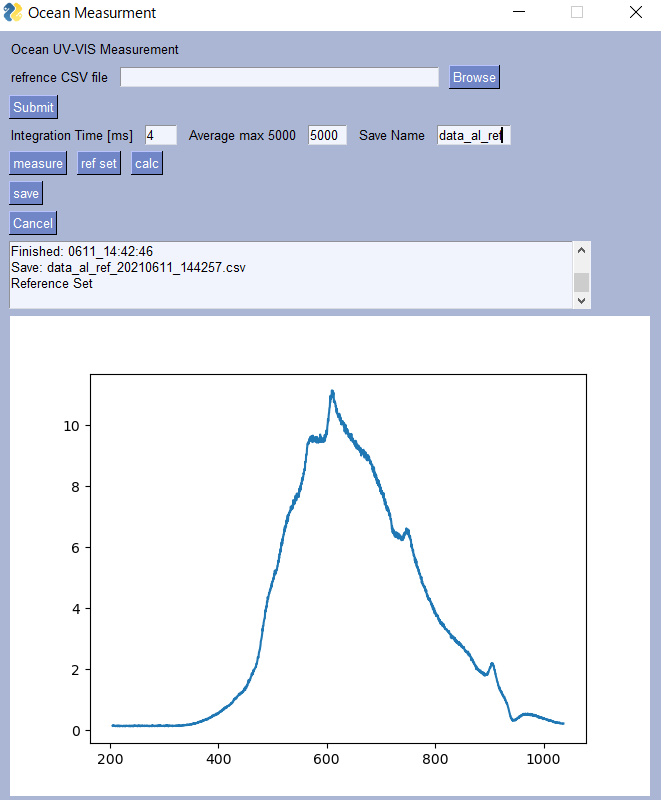
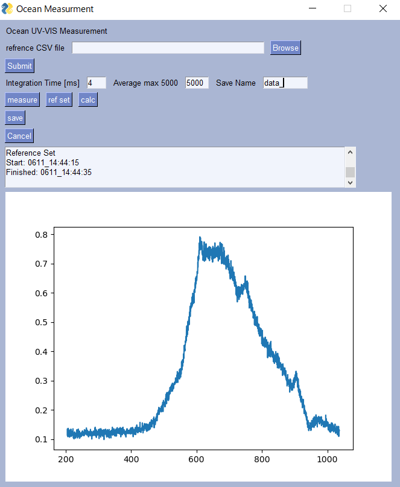
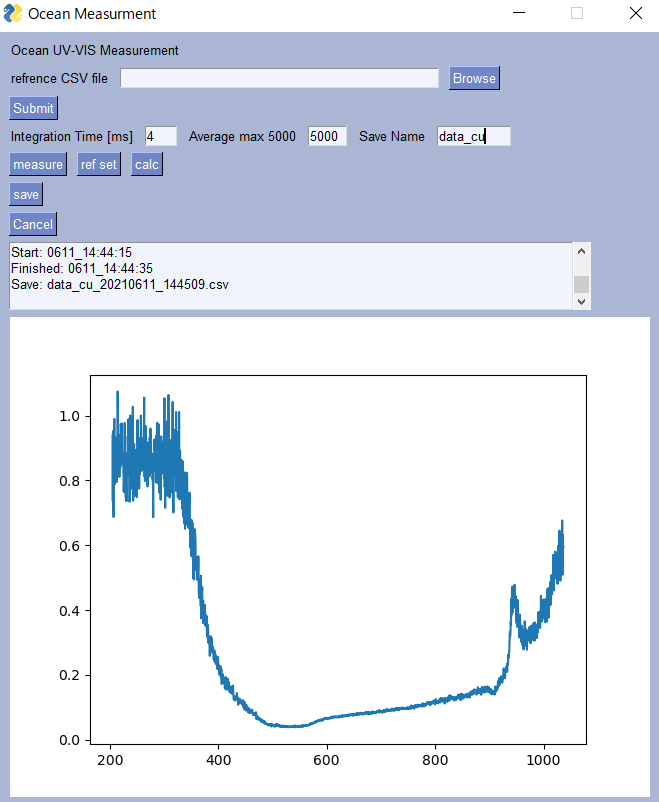

# OceanOptics分光器のWindows用反射測定GUI

反射測定用GUI

Oceanopticsのsetupはこちらの記事を参考にインストールと設定をしてください。

[Python module for Ocean Optics spectrometersのインストール方法](https://qiita.com/Gyutan/items/d792bb36f5a862836d63)

反射測定を行いますので、光源、反射プローブ、分光器、試料を用意してください。

ocean_gui.pyを実行します。

PysimpleGUIで作成したGUIが立ち上がります。

*measure* ボタンを押すと測定が行われて測定結果が表示されます。測定結果をリファレンスにしたいときは*referset*ボタンを押します。データを保存したいときは*Save*を押します。

リファレンスとして鏡面のAlを測定します。これをSaveします。そしてrefsetボタンを押してリファレンスにセットします。

次に測定したい試料をセットして測定します。今回はCu

次にcalcボタンを押すと反射スペクトルが表示されます。今回はdark測定は行っていません。またその補正も行っていません。

